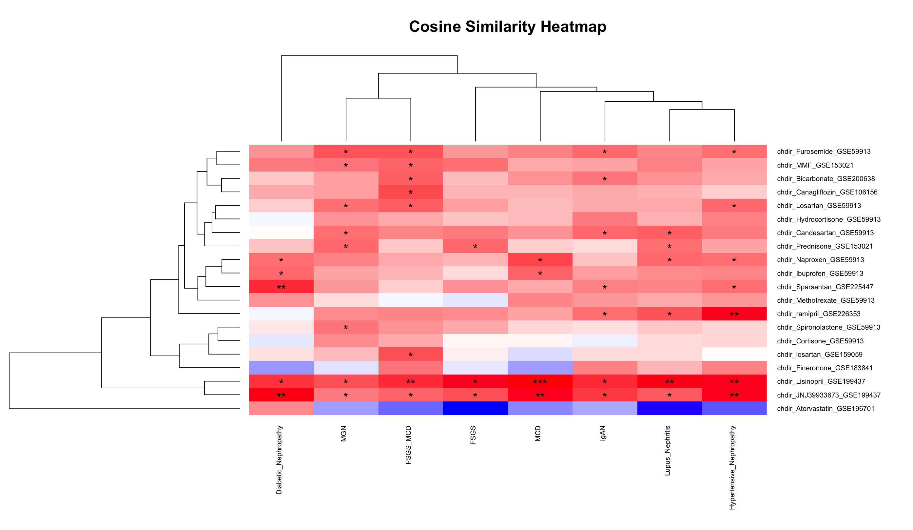
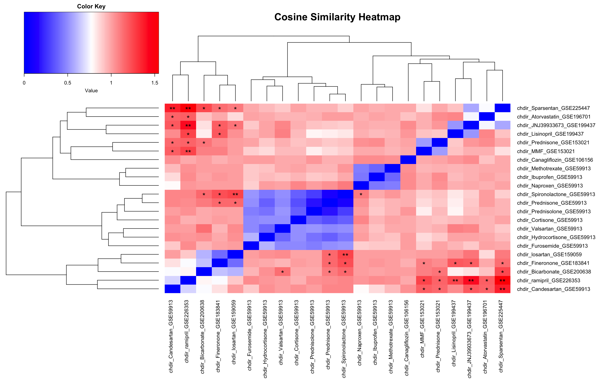

# 1. Study Overview

## 1.1 Objective
The main objective of this study was to implement the characteristic direction (CD) statistical method on drug and disease data to identify connections and comparisons in gene expression movement between a given drug and kidney disease state.

## 1.2 Methods and Techniques
This study employed various methods and techniques from existing literature to process and analyze the data:

1. Data Processing:
   - Loaded data from Gene Expression Omnibus (GEO) local files or queries.
   - Filtered, cleaned, and normalized data in fragments per kilobase of transcript per million mapped reads (FPKM) format (1).
   - Standardized genes for multi-study integration and preparation for the CD analysis (2).

2. Characteristic Direction (CD) Analysis:
   - Applied the CD method to identify differentially expressed genes (DEGs) between drug and disease conditions.
   - Compared the CD results with traditional DEG identification methods, such as Significance Analysis of Microarrays (SAM), Linear Models for Microarray Data (LIMMA), differential gene expression analysis based on the negative binomial distribution (DESeq), and Empirical analysis of Digital Gene Expression data in R (edgeR) (3).

## 1.3 Significance
Identifying DEGs is a crucial step in genome-wide expression profiling studies. Traditional methods, such as SAM, LIMMA, DESeq, and edgeR, are commonly used (4). However, applying the CD method may uncover novel biological associations not observed by the current state-of-the-art DEG methods.

This study establishes the CD method for comparing gene expression changes between drugs and diseases. By analyzing the gene movement patterns, we can assess the harmony or discordance of gene expression changes between different drugs or between a drug and a disease. Ideally, this information can begin to provide insights into potential drug-disease interactions and guide further investigations.

This study's significance lies in its potential to shed light on new biological mechanisms and identify drug-disease interactions that may have implications for drug repurposing, understanding disease pathways, and developing targeted therapies.

# 2. Data Normalization and Integration

## 2.1 Data Normalization
The disease data was sourced from a study on public transcriptomic data. It underwent cyclic loess normalization using the limma package, followed by YuGene transformation using the YuGene R package. Batch effect mitigation was performed by structuring the data in a platform-specific manner, depending on the source of the data, conducting differential gene expression analysis between identical biological conditions from distinct study sources noted in the Data Availability section, and removing significantly differentially expressed genes between them. The data sets from Affymetrix Human Genome U133 Plus 2.0 Array and Affymetrix Human Genome U133A Array were merged using overlapping genes, and a platform-induced batch effect mitigation process was applied (3).

For the drug data, the normalization process focused on selecting kidney-related data and applying DESeq2 normalization. Some datasets already had DESeq2-processed data, so the normalization step was skipped. Gene IDs were identified and then converted to gene symbols to ensure compatibility with the chdir package and standardize the genes for data combination.

## 2.2 Data Integration
Data from different sources was integrated using a series of scripts that involved data preprocessing, batch effect mitigation, and data preparation for characteristic direction analysis.

1. Integration Script:
   - The glomerular data (`Glom_570`) and corresponding sample information (`Glom_570_Info.csv`) were imported and preprocessed.
   - Specific samples (Tumor Nephrectomy and IgAN) were removed, and the "Healthy Living Donor" group labels were updated.
   - The YuGene transformation was applied to the expression data.
   - The processed data and sample information were stored in the `processed_glom_570` object and saved as an R data file.

2. Batch Mitigation Script:
   - The processed data from the previous script (`process_glom_570.RData`) and another dataset (`process_glom_96.RData`) were loaded.
   - Common genes between the two datasets were identified, and the data matrices were subsetted and reordered based on the common genes.
   - The combined data matrix (`glom_all`) and sample information (`info_glom_all`) were created by merging the two datasets.
   - Batch effect mitigation was performed using the ComBat method from the sva package.
   - The batch-corrected data was stored in the `glom_all` matrix.
   - The processed data, including the batch-corrected data and sample information, were saved as `process_glom_all.RData`.

3. Characteristic Direction Preparation Script:
   - The gene expression data and sample information were extracted from the `processed_glom_all` object.
   - The data was filtered to keep only the GPL96 platform samples, as the GPL570 data had affected the ratio of controls to disease states by a large margin.
   - Unique disease groups were identified, and "Healthy Living Donor" samples were combined.
   - For each disease group, a combined dataset with healthy and disease samples was created.
   - Labels were assigned to the samples (0 for healthy, 1 for disease).
   - The combined data, along with the labels, were exported as text files for each disease group.

The integration process involved the following key steps:
1. Importing and preprocessing the glomerular data from different sources.
2. Applying data transformations (e.g., YuGene) and batch effect mitigation (ComBat) to ensure consistency and comparability across datasets.
3. Combining the preprocessed datasets and creating a unified data matrix and sample information object.
4. Preparing the data for characteristic direction analysis by filtering specific platforms, identifying disease groups, and creating labeled datasets for each disease group.

These scripts demonstrate a systematic approach to integrating gene expression data from multiple sources, handling batch effects, and preparing the data for downstream analysis using the characteristic direction method.

The code for the integration process can be found in the following scripts:
- Integration Script: [link to script]
- Batch Mitigation Script: [link to script]
- Characteristic Direction Preparation Script: [link to script]

## 2.3 Challenges
The data normalization and integration process presented several challenges:

1. The disease state data was relatively clean and manageable since it came from the same tissue sources. However, the data was originally intended for other purposes, making it less malleable to conform with this study's objectives.

2. The drug data was obtained from multiple sources, each with unique formats for storing expression data, metadata, and phenotype data. Sifting through the data to extract the desired information was challenging and required unique methods for each dataset.

Despite these challenges, the data was successfully normalized and integrated to ensure consistency and comparability for the subsequent analysis steps.

# 3. Differential Expression (DE) Analysis
## 3.1 Characteristic Direction (CD) Method

The Characteristic Direction (CD) method is powerful for identifying differentially expressed genes (DEGs) between different biological conditions or classes. It utilizes linear classification techniques to define a separating hyper-plane that best distinguishes between the classes based on their gene expression profiles (2).

Let's dive deeper into the mathematical formulation and the key steps involved in the CD method:

### Mathematical Formulation

Suppose we have gene expression data from $N$ samples, measuring the expression of $p$ genes. Let each expression profile sample form a row of the matrix $X$ (an $N \times p$ matrix). The samples belong to one of $K$ classes, denoted by the set $G$.

In linear discriminant analysis (LDA), the log-ratio of class posteriors $P(G|X)$ is given by:

$$\log\frac{Pr(G=k|X=x)}{Pr(G=l|X=x)} = \log\frac{\pi_k}{\pi_l} - \frac{1}{2}(\mu_k - \mu_l)^T\Sigma^{-1}(\mu_k - \mu_l) + x^T\Sigma^{-1}(\mu_k - \mu_l)$$

where $\pi_k$ is the prior probability of class $k$, $\mu_k$ is the mean of class $k$, and $\Sigma$ is the covariance matrix (assumed to be the same for all classes).

The orientation of the separating hyper-plane between classes $k$ and $l$ is defined by the normal $p$-vector $b$, given by:

$$b = \Sigma^{-1}(\mu_k - \mu_l)$$

The direction of the $p$-vector $b$ represents the direction in the expression space that best characterizes the differential expression between the classes.

### Key Steps

1. **Computing class means and covariance matrix:**
   - Calculate the class means $\mu_k$ and $\mu_l$ from the gene expression data for each class.
   - Estimate the covariance matrix $\Sigma$ from the data.

2. **Estimating the separating hyper-plane orientation:**
   - Compute the orientation of the separating hyper-plane $b$ using the class means and the inverse of the covariance matrix, as shown in the equation above.

3. **Applying regularization techniques:**
   - Address the singularity and high variance issues that arise when estimating the covariance matrix from limited samples ($p >> N$).
   - Apply regularization techniques, such as shrinkage, to stabilize the covariance matrix estimation. For example, the covariance matrix can be shrunk towards the scalar variance: $$\hat{\Sigma}(\gamma) = \gamma\hat{\Sigma} + (1-\gamma)\sigma^2I_p, \quad \text{with } \gamma \in [0, 1]$$ where $\hat{\Sigma}$ is the estimated covariance matrix, $\sigma^2$ is the scalar covariance, and $I_p$ is the identity matrix of size $p$.
   - The inclusion of a constant on the diagonal resolves the singularity problem, and the modulation of the off-diagonal terms helps to reduce noise.

4. **Interpreting the components of the normalized vector b:**
   - Normalize the vector $b$ to obtain $\hat{b}$, which contains information about the direction of the normal to the separating hyper-plane.
   - The components of $\hat{b}$ are the direction cosines, and their magnitude quantifies the degree of alignment of the direction to the axes corresponding to each gene.
   - The sign of each component can be interpreted as the sign of the contribution of each gene to the differential expression.
   - The contribution of each $\hat{b}i^2$ to the sum $\sum{i=1}^p \hat{b}_i^2 \equiv 1$ can be interpreted as quantifying the relative contribution of each component to the total differential expression, indicating the significance of the corresponding gene.

5. **Ranking and identifying significant DEGs:**
   - Use the relative contributions of each gene (based on the components of $\hat{b}$) to rank the genes in order of their significance to the differential expression.
   - Identify a shortlist of significant DEGs by applying a suitable threshold or regularization scheme, such as L1 regularization, which results in automatic feature selection by setting many components to zero.

The CD method provides a quantitative measure of the relative significance of each gene to the differential expression, enabling the ranking and identification of DEGs. The geometric interpretation of the separating hyper-plane and its normal vector offers an intuitive understanding of the differential expression patterns between different biological conditions or classes.

By applying the CD method to gene expression data, researchers can gain insights into the genes that are most relevant to the differences between the classes and prioritize them for further investigation and validation.

## 3.2 Implementation and Application

The CD method was implemented in Python using the `chdir` function, taken from the `chdir.R` or `geode.py` scripts, as they are equivalent. Let's break down the function and explain each major section of the code:

1. **Input Validation:**
   The function starts by validating the input data. It checks if the control and experimental gene expression data matrices have the same number of genes (rows) and if there are any missing values (NA) in the data. If any issues are detected, the function stops and provides an appropriate error message.

2. **Constant Gene Removal:**
   The code then checks for genes with constant expression values across all samples. Constant genes can dramatically affect the LDA calculation and lead to incorrect results. If any constant genes are found, the function stops and suggests removing those genes from the analysis.

3. **Data Combination and Dimension Extraction:**
   The control and experimental gene expression data matrices are combined into a single matrix called `combinedData`. The dimensions of the combined data matrix are extracted, including the number of samples (`samplesCount`) and the number of genes.

4. **Principal Component Analysis (PCA):**
   To reduce the computational workload, the code performs PCA on the transposed `combinedData` matrix using the `nipals` algorithm. The `nipals` function is used to calculate the scores (`R`), loadings (`V`), and variances (`pcvars`) captured by each principal component. The number of components to calculate is determined based on the number of samples and a maximum of 20 components.

5. **Variance Threshold and Component Selection:**
   The code selects the principal components that capture at least 95% of the total variance. It determines the index (`cutIdx`) of the component at which the cumulative variance exceeds the 95% threshold. If no components meet this criterion, all components are selected. The scores (`R`) and loadings (`V`) matrices are then sliced to include only the selected components.

6. **Mean Difference Calculation:**
   The difference between the mean expression values of the experimental and control groups is calculated and stored in the `meanvec` variable.

7. **Covariance Matrix Shrinkage:**
   The code calculates the shrunk covariance matrix (`shrunkMats`) based on the selected principal components. This step is crucial for regularization and noise reduction. The shrinkage is performed by combining the diagonal matrix of the selected components (`Dd`) with the scalar covariance (`sigma`) using the regularization term (`r`).

8. **Characteristic Direction Calculation:**
   The characteristic direction (`b`) is calculated using the LDA formula. The loadings matrix (`V`) is used to transform the covariance matrix from the subspace to the full space. The `solve` function is used to compute the inverse of the shrunk covariance matrix. The resulting vector `b` represents the direction that best characterizes the differential expression between the experimental and control groups.

9. **Vector Normalization and Sorting:**
   The characteristic direction vector `b` is normalized to a unit vector. Then, the absolute values of the components of `b` are sorted in decreasing order, and the corresponding indices are obtained. The sorted characteristic direction vector (`bSorted`) and the sorted gene names (`genesSorted`) are created based on the sorting indices.

10. **Output:**
    The sorted characteristic direction vector `bSorted` is returned as the output of the `chdir` function. The row names of `bSorted` are set to the sorted gene names `genesSorted`.

# 4. 1-Cosine Similarity

## 4.1 Cosine Similarity and its Purpose

Cosine similarity is a widely used measure between two non-zero vectors, calculated as the cosine of the angle between them. It ranges from -1 to 1, where 1 indicates high similarity, and 0 indicates dissimilarity (5).

The choice of 1-cosine similarity was influenced by its effectiveness in capturing the similarity between high-dimensional gene expression profiles or document vectors, as demonstrated in previous studies on genetic interaction data (16). Cosine similarity focuses on the angle between the vectors and is insensitive to their magnitude, making it suitable for comparing relative patterns of gene expression.

To calculate 1-cosine similarity, I utilized the `cosine()` function from the `lsa` library in R. First, I created a data matrix containing the gene signature values from the characteristic direction method for both drug and disease data. Then, I calculated the cosine similarity between each pair of columns (representing drugs and diseases) in the data matrix using nested loops. Finally, I subtracted the cosine similarity values from 1 to obtain the 1-cosine similarity.

## 4.2 Advantages of using 1-cosine similarity

I decided to use 1-cosine similarity in my study based on several advantages. As mentioned earlier, cosine similarity effectively captures the similarity between high-dimensional gene expression profiles. It is insensitive to the magnitude of the vectors and focuses on the angle between them, making it suitable for comparing relative patterns of gene expression (6).

Moreover, cosine similarity has been shown to be robust to thresholding effects compared to other measures like Pearson correlation, which may be sensitive to thresholding due to normalization factors (6). By using 1-cosine similarity, I aimed to leverage these advantages while having a metric that increases with dissimilarity, aligning with the objectives of my study.

## 4.3 Limitations and Challenges 

While 1-cosine similarity proved a valuable measure in my study, as noted in the literature, cosine similarity may be sensitive to the normalization of the vectors. It may not capture non-linear relationships between vectors (3).

Although my code does not explicitly display specific challenges, it is possible that similar issues were encountered during the analysis. Different similarity measures, even those with comparable performance, can also capture different sets of top similar gene pairs (7). Therefore, incorporating multiple measures and comparing their results could have provided a more comprehensive understanding of the relationships in the data.

# 5. Results

## 5.1 Drug vs Disease

This cosine similarity matrix displays the similarities between the movement of drug-gene expression profiles and various kidney disease states. 

### 5.1.1 Cosine Similarity Matrix

Higher values indicate greater similarity between the drug and disease profiles. Notable findings from the cosine similarity matrix include:

- Lisinopril (chdir_Lisinopril_GSE199437) exhibits the highest similarity across multiple kidney diseases, including MCD (1.1541379), Lupus Nephritis (1.1309973), Hypertensive Nephropathy (1.1228615), and FSGS (1.1151803). This suggests that Lisinopril may have potential therapeutic effects in these diseases.

- JNJ39933673 (chdir_JNJ39933673_GSE199437) also shows high similarity with various kidney diseases, such as Diabetic Nephropathy (1.1312115), MCD (1.1194360), Hypertensive Nephropathy (1.1152950), and FSGS (1.0532960). This indicates that JNJ39933673 may be a promising drug candidate for further investigation in these disease contexts.

- Ramipril (chdir_ramipril_GSE226353) demonstrates high similarity with Hypertensive Nephropathy (1.1183655) and Lupus Nephritis (1.0493342), suggesting its potential efficacy in treating these conditions or at least similar movement.

- Sparsentan (chdir_Sparsentan_GSE225447) exhibits high similarity with Diabetic Nephropathy (1.0882484), indicating its potential as a therapeutic option for this specific kidney disease.

- Furosemide (chdir_Furosemide_GSE59913) shows high similarity with MGN (1.0486337), FSGS_MCD (1.0491503), IgAN (1.0290862), and Hypertensive Nephropathy (1.0215214), suggesting its potential applicability in these kidney disorders.

### 5.1.2 Statistical Significance

A permutation test was performed to assess the statistical significance of the cosine similarity values. The resulting p-values were categorized into different significance levels: p < 0.05 (\*), p < 0.01 (\*\*), and p < 0.001 (\*\*\*).

Some of the statistically significant similarities include:

- Lisinopril (chdir_Lisinopril_GSE199437) shows highly significant similarity (p < 0.001, \*\*\*) with MCD, and significant similarity (p < 0.01, \*\*) with Lupus Nephritis, Hypertensive Nephropathy, and FSGS.

- JNJ39933673 (chdir_JNJ39933673_GSE199437) exhibits significant similarity (p < 0.01, \*\*) with Diabetic Nephropathy and Hypertensive Nephropathy, and significant similarity (p < 0.05, \*) with FSGS_MCD, FSGS, IgAN, Lupus Nephritis, and MCD.

- Sparsentan (chdir_Sparsentan_GSE225447) shows highly significant similarity (p < 0.01, \*\*) with Diabetic Nephropathy and significant similarity (p < 0.05, \*) with IgAN.

### 5.1.3 Interpretation and Implications

The cosine similarity matrix provides a comprehensive view of the similarities between drug-gene expression and kidney disease profiles. The results highlight several drugs, such as Lisinopril, JNJ39933673, Ramipril, Sparsentan, and Furosemide, that exhibit significant similarity with multiple kidney diseases. These drugs may have the potential for repurposing and warrant further investigation in preclinical and clinical studies.

The identification of statistically significant similarities between specific drugs and diseases can guide future research efforts to elucidate the shared molecular pathways and mechanisms of action. This knowledge can aid in the development of targeted therapies and personalized treatment strategies for kidney diseases.

However, it is important to note that these findings are based on various and individually sourced gene expression data and require validation through additional experimental and clinical studies. The cosine similarity matrix and its interpretations serve as a valuable starting point for generating hypotheses and prioritizing drug candidates for further exploration in the context of kidney diseases.

## 5.2 Drug vs Drug

The cosine similarity matrix drug-drug interaction delivers insights into the similarities between gene expression profiles of drugs tested on kidney tissue. We can identify drugs with similar effects on kidney gene expression and potential drug repurposing candidates by analyzing this matrix and the corresponding significance matrix.

### 5.2.1 Cosine Similarity Matrix

The cosine similarity matrix reveals the degree of similarity between drugs’ gene expression profiles. Higher values indicate greater similarity between the drugs' effects on kidney gene expression. Notable findings from the cosine similarity matrix include:

- Ramipril (chdir_ramipril_GSE226353) and Sparsentan (chdir_Sparsentan_GSE225447) exhibit the highest similarity among all drug pairs, with a cosine similarity value of 1.5453496. This suggests that these two drugs may have similar effects on kidney gene expression and could be repurposed for similar indications.

- JNJ39933673 (chdir_JNJ39933673_GSE199437) shows high similarity with Ramipril (chdir_ramipril_GSE226353) (1.4136024) and Candesartan (chdir_Candesartan_GSE59913) (1.1942767), indicating that these drugs may share similar gene expression direction in the kidney.

- Lisinopril (chdir_Lisinopril_GSE199437) demonstrates high similarity with Ramipril (chdir_ramipril_GSE226353) (1.2530703), suggesting that these ACE inhibitors may have comparable effects on kidney gene expression.

Spironolactone (chdir_Spironolactone_GSE59913) and Finerenone (chdir_Finerenone_GSE183841) show high similarity (1.2222069), indicating potential similarities in their effects on kidney gene expression. This is consistent with their shared mechanism of action as mineralocorticoid receptor antagonists.

- Bicarbonate (chdir_Bicarbonate_GSE200638) exhibits high similarity with several drugs, including Sparsentan (chdir_Sparsentan_GSE225447) (1.2379868), Spironolactone (chdir_Spironolactone_GSE59913) (1.1547340), and Prednisone (chdir_Prednisone_GSE59913 and chdir_Prednisone_GSE153021) (1.1082566 and 1.1138565, respectively). This suggests that bicarbonate treatment may have overlapping downstream effects on kidney gene expression with these drugs.

### 5.2.2 Statistical Significance

The significance matrix provides information about the statistical significance of the cosine similarity values. Some of the statistically significant similarities include:

- Ramipril (chdir_ramipril_GSE226353) and Sparsentan (chdir_Sparsentan_GSE225447) show highly significant similarity (p < 0.001, \*\*\*).

- JNJ39933673 (chdir_JNJ39933673_GSE199437) exhibits significant similarity with Ramipril (chdir_ramipril_GSE226353) (p < 0.01, \*\*) and Candesartan (chdir_Candesartan_GSE59913) (p < 0.05, \*).

- Spironolactone (chdir_Spironolactone_GSE59913) and Finerenone (chdir_Finerenone_GSE183841) have significant similarity (p < 0.05, \*).

### 5.2.3 Interpretation and Implications

The cosine similarity matrix and significance matrix provide valuable information about the similarities between drug gene expression profiles in kidney tissue. The results highlight several drugs with significant similarities, such as Ramipril and Sparsentan, JNJ39933673 and Ramipril/Candesartan, Lisinopril and Ramipril, and Spironolactone and Finerenone. These findings suggest that these drugs may share similar mechanisms of action or have overlapping effects on kidney gene expression.

The identification of significant similarities between drugs can guide further research into potential drug repurposing opportunities. Drugs with high similarity scores and statistical significance could be prioritized for preclinical and clinical studies to explore their therapeutic potential in kidney-related disorders.

Moreover, understanding the similarities between drugs’ gene expression profiles can provide insights into the underlying molecular mechanisms and pathways affected by these drugs in the kidney. This knowledge can aid in the development of targeted therapies and personalized treatment strategies for kidney diseases.

As with the drug and disease data, these findings are not definitive. They are based on gene expression data from kidney tissue and cannot fully capture the complexities of drug effects in vivo. Additional experimental and clinical validation is necessary to confirm the therapeutic potential and safety of repurposing these drugs for kidney-related indications.

# 6. Data Summary
## 6.1 Data Availability

The datasets used in this study are publicly available and can be accessed through the following sources:

### 6.1.1 Disease Data
The disease data was obtained from the study by Tajti, Ferenc et al. "A Functional Landscape of CKD Entities From Public Transcriptomic Data." (3) The raw data CEL files of each microarray dataset (GSE20602, GSE32591, GSE37460, GSE47183, and GSE50469) can be downloaded from the NCBI GEO Datasets site: https://www.ncbi.nlm.nih.gov/gds.

### 6.1.2 Drug Data
The drug data was obtained from multiple datasets, and the folders were named in the format `drugname_GEO_Dataset`. The unique list of GEO datasets and their corresponding drugs are as follows:

- [GSE196701]( https://www.ncbi.nlm.nih.gov/geo/query/acc.cgi?acc=GSE196701): Atorvastatin (8). 
- [GSE200638]( https://www.ncbi.nlm.nih.gov/geo/query/acc.cgi?acc=GSE200638): Bicarbonate (9). 
- [GSE106156]( https://www.ncbi.nlm.nih.gov/geo/query/acc.cgi?acc=GSE106156): Canagliflozin (10). 
- [GSE59913]( https://www.ncbi.nlm.nih.gov/geo/query/acc.cgi?acc=GSE59913): Candesartan, Cortisone, Furosemide, Hydrocortisone, Ibuprofen, Methotrexate, Naproxen, Prednisolone, Spironolactone, Valsartan. 
- [GSE183841]( https://www.ncbi.nlm.nih.gov/geo/query/acc.cgi?acc=GSE183841): Finerenone (11). 
- [GSE199437]( https://www.ncbi.nlm.nih.gov/geo/query/acc.cgi?acc=GSE199437): JNJ39933673 (an SGLT2 inhibitor), Lisinopril (12). 
- [GSE159059]( https://0-www-ncbi-nlm-nih-gov.brum.beds.ac.uk/geo/query/acc.cgi?acc=GSE159059): Losartan (13). 
- [GSE153021]( https://www.ncbi.nlm.nih.gov/geo/query/acc.cgi?acc=GSE153021): MMF, Prednisone (14). 
- [GSE226353]( https://www.ncbi.nlm.nih.gov/geo/query/acc.cgi?acc=GSE226353): Ramipril 
- [GSE225447]( https://www.ncbi.nlm.nih.gov/geo/query/acc.cgi?acc=GSE225447): Sparsentan (15). 

All drug datasets are publicly available and can be downloaded from the NCBI GEO Datasets site: https://www.ncbi.nlm.nih.gov/gds. There are no restrictions or limitations on the availability of the datasets used in this study. All datasets are publicly accessible and can be used for further research and analysis.

### 6.1.3 Processed Datasets
The processed datasets generated during this study, including the normalized gene expression data and the characteristic direction analysis results, are available in the "Data" folder.

The GitHub repository provides the processed datasets and the code used for data normalization, integration, and analysis.

# 7. References

1.	Zhao Y, Li MC, Konaté MM, Chen L, Das B, Karlovich C, et al. TPM, FPKM, or Normalized Counts? A Comparative Study of Quantification Measures for the Analysis of RNA-seq Data from the NCI Patient-Derived Models Repository. J Transl Med. 2021 Dec;19(1):269. 
2.	Clark NR, Hu KS, Feldmann AS, Kou Y, Chen EY, Duan Q, et al. The characteristic direction: a geometrical approach to identify differentially expressed genes. BMC Bioinformatics. 2014 Dec;15(1):79. 
3.	Tajti F, Kuppe C, Antoranz A, Ibrahim MM, Kim H, Ceccarelli F, et al. A Functional Landscape of CKD Entities From Public Transcriptomic Data. Kidney International Reports. 2020 Feb;5(2):211–24. 
4.	Seyednasrollah F, Laiho A, Elo LL. Comparison of software packages for detecting differential expression in RNA-seq studies. Briefings in Bioinformatics. 2015 Jan 1;16(1):59–70. 
5.	Cai S, Georgakilas GK, Johnson JL, Vahedi G. A Cosine Similarity-Based Method to Infer Variability of Chromatin Accessibility at the Single-Cell Level. Front Genet. 2018 Aug 15;9:319. 
6.	Deshpande R, VanderSluis B, Myers CL. Comparison of Profile Similarity Measures for Genetic Interaction Networks. Qian X, editor. PLoS ONE. 2013 Jul 10;8(7):e68664. 
7.	Liu M, Thomas PD. GO functional similarity clustering depends on similarity measure, clustering method, and annotation completeness. BMC Bioinformatics. 2019 Dec;20(1):155. 
8.	Huang TS, Wu T, Wu Y di, Li XH, Tan J, Shen CH, et al. Long-term statins administration exacerbates diabetic nephropathy via ectopic fat deposition in diabetic mice. Nat Commun. 2023 Jan 24;14(1):390. 
9.	Gantsova EA, Serova OV, Eladari D, Bobrovskiy DM, Petrenko AG, Elchaninov AV, et al. A Comparative Kidney Transcriptome Analysis of Bicarbonate-Loaded insrr-Null Mice. CIMB. 2023 Dec 4;45(12):9709–22. 
10.	Perco P, Ju W, Kerschbaum J, Leierer J, Menon R, Zhu C, et al. Identification of dicarbonyl and L-xylulose reductase as a therapeutic target in human chronic kidney disease. JCI Insight. 2019 Jun 20;4(12):e128120, 128120. 
11.	Abedini A, Sánchez-Navaro A, Wu J, Klötzer KA, Ma Z, Poudel B, et al. Single-cell transcriptomics and chromatin accessibility profiling elucidate the kidney-protective mechanism of mineralocorticoid receptor antagonists. J Clin Invest. 2024 Jan 2;134(1):e157165. 
12.	Wu H, Gonzalez Villalobos R, Yao X, Reilly D, Chen T, Rankin M, et al. Mapping the single-cell transcriptomic response of murine diabetic kidney disease to therapies. Cell Metab. 2022 Jul 5;34(7):1064-1078.e6. 
13.	Eid SA, Hinder LM, Zhang H, Eksi R, Nair V, Eddy S, et al. Gene expression profiles of diabetic kidney disease and neuropathy in eNOS knockout mice: Predictors of pathology and RAS blockade effects. FASEB J. 2021 May;35(5):e21467. 
14.	Fu J, Wang Z, Lee K, Wei C, Liu Z, Zhang M, et al. Transcriptomic analysis uncovers novel synergistic mechanisms in combination therapy for lupus nephritis. Kidney International. 2018 Feb;93(2):416–29. 
15.	Kohan DE, Barratt J, Heerspink HJL, Campbell KN, Camargo M, Ogbaa I, et al. Targeting the Endothelin A Receptor in IgA Nephropathy. Kidney International Reports. 2023 Nov;8(11):2198–210. 
16.   Duan, Qiaonan et al. “L1000CDS2: LINCS L1000 characteristic direction signatures search engine.” NPJ systems biology and applications vol. 2 (2016): 16015–. doi:10.1038/npjsba.2016.15

